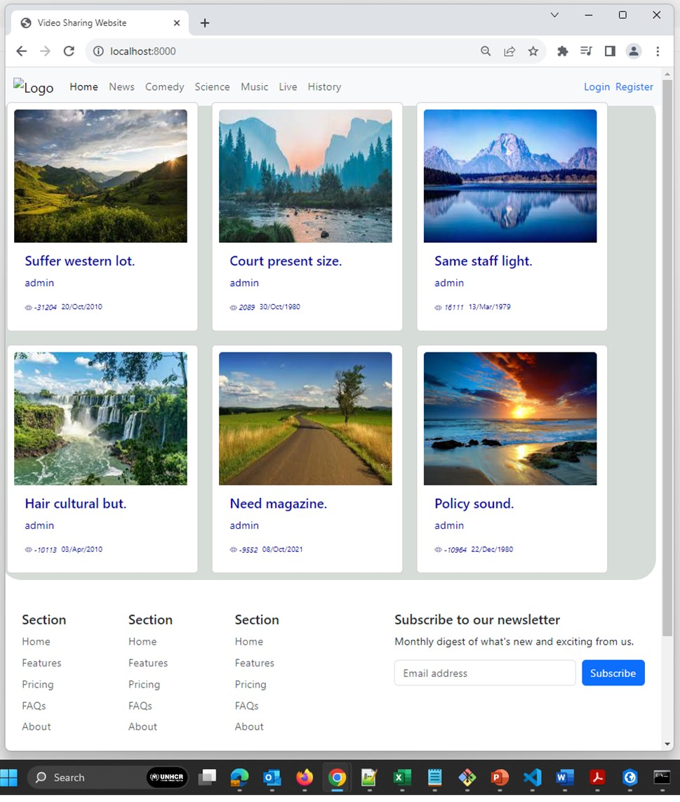
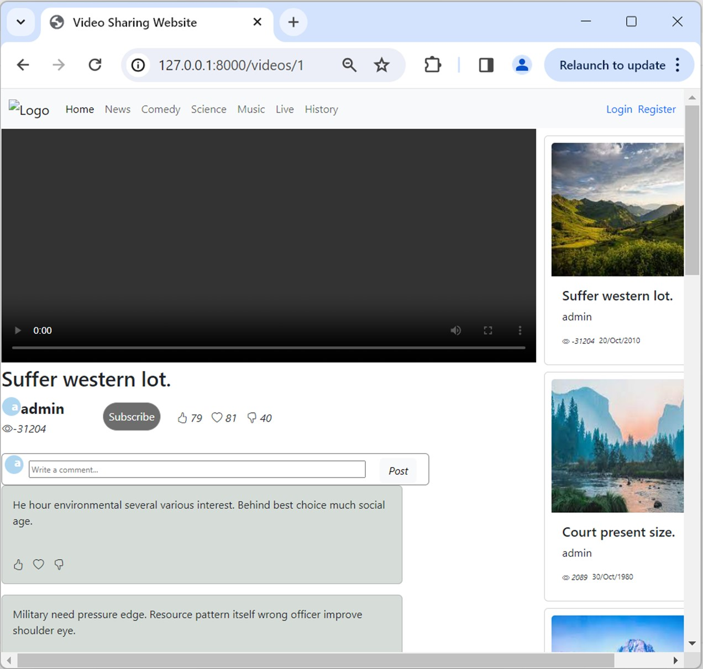

# E-Commerce Webpage
This project aim to demostrate how Video Sharing Website can be developed using Python + Django

Home page

Video page

## To run the project

Type and run in commandline the follow command to install required packages

### `pip install -r requirements.txt`

Type and run in commandline

### `py manage.py migrate`

### `py manage.py runserver`

Server will run on [http://127.0.0.1:8000]